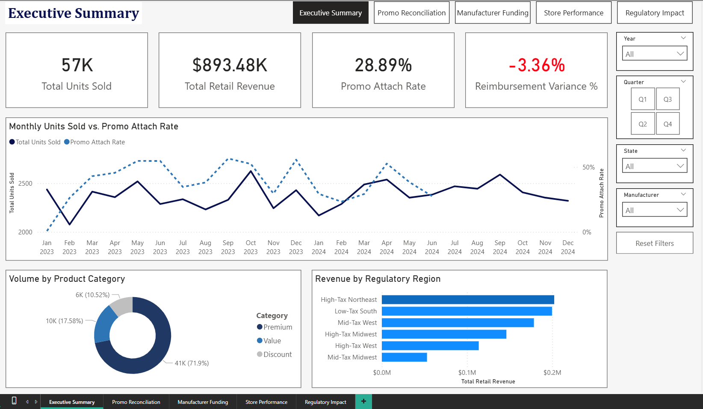
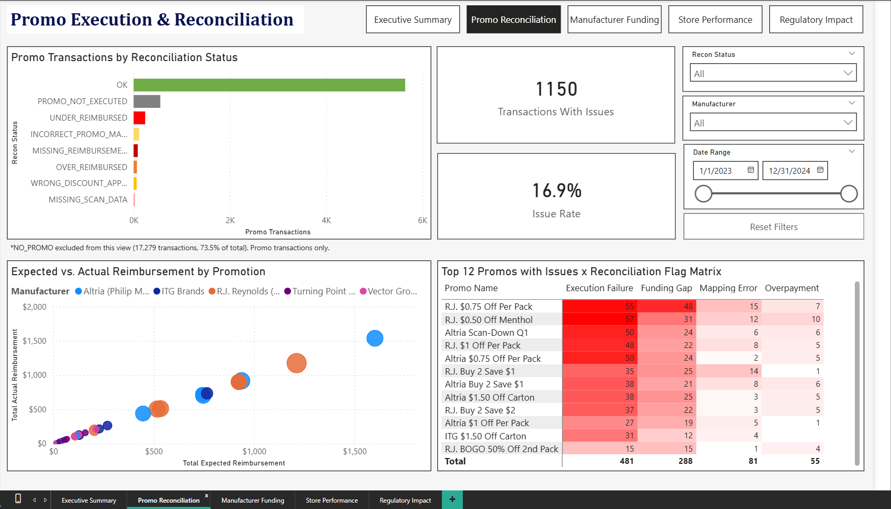
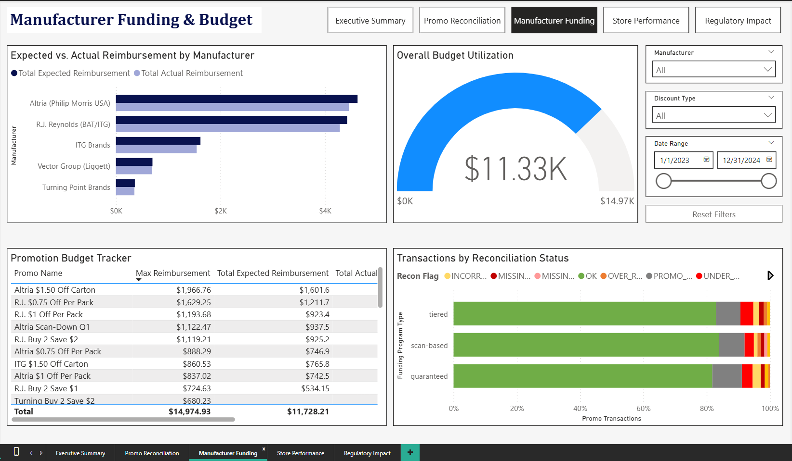
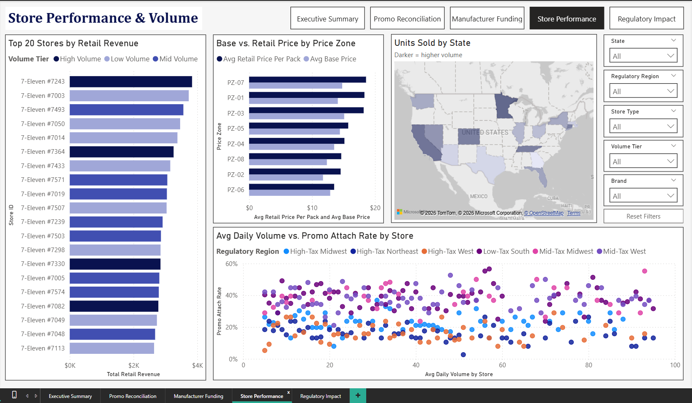
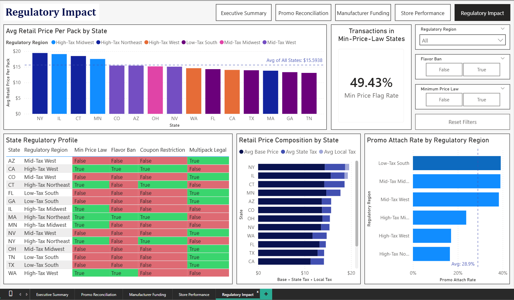

# Dashboard Guide

**Project:** 711-tobacco-promo-analysis  
**Tool:** Power BI Desktop  
**Pages:** 5  
**Screenshots:** `/images/` folder

This document describes each dashboard page — the business question it answers, the visuals it contains, and the DAX measures powering it. Since the `.pbix` file is not published, this guide is the primary reference for understanding what was built and why.

---

## Page 1: Executive Summary

**Business question:** How is the overall business performing across volume, revenue, promotional participation, and reimbursement health?

The entry point for any reader. Four KPI cards give instant orientation; the dual-axis line chart is the centerpiece, showing the relationship between promotional activity and unit volume over time; and the two supporting charts break performance down by product mix and regulatory environment.



### Visuals

| Visual | Type | Description |
|---|---|---|
| Total Units Sold | KPI card | Sum of `units_sold` across all transactions |
| Total Retail Revenue | KPI card | Sum of `store_retail_price` across all transactions |
| Promo Attach Rate | KPI card | % of transactions with an active promotion |
| Reimbursement Variance % | KPI card | Recon variance as a % of expected reimbursement; negative = net shortfall |
| Monthly Units Sold vs Promo Attach Rate | Dual-axis line chart | X-axis: months; left Y-axis: Total Units Sold; right Y-axis: Promo Attach Rate (%); shows how promotional coverage tracks with volume over time |
| Volume by Product Category | Donut chart | Units sold split by product category (Premium / Value / Discount) |
| Revenue by Regulatory Region | Bar chart | Total retail revenue grouped by regulatory region |

### DAX Measures

```dax
Total Units Sold =
SUM(fact_transactions[units_sold])

Total Retail Revenue =
SUM(fact_transactions[store_retail_price])

Promo Attach Rate =
DIVIDE(
    CALCULATE(COUNTROWS(fact_transactions), NOT ISBLANK(fact_transactions[promo_id])),
    COUNTROWS(fact_transactions)
)

Reimbursement Variance % =
DIVIDE(
    SUM(fact_transactions[recon_variance]),
    SUM(fact_transactions[expected_reimbursement])
)
```

---

## Page 2: Promo Reconciliation

**Business question:** Where is the promotional reimbursement process breaking down, and how much is at risk?

This page answers the questions a pricing analyst would ask after month-end close. The bar chart shows the distribution of reconciliation outcomes; the KPI cards quantify the problem; the scatter plot surfaces which specific promotions have the widest expected-vs-actual gaps; and the matrix table identifies the promotions with the most systemic issues.



### Visuals

| Visual | Type | Description |
|---|---|---|
| Promo Transactions by Reconciliation Status | Color-coded bar chart | Transaction count by `recon_flag` category; each status (CLEAN, MISSING_SCAN, WRONG_DISCOUNT, BUDGET_EXHAUSTED, PARTIAL_REIMB) rendered in a distinct color |
| Transactions With Issues | KPI card | Count of transactions where `recon_flag` ≠ CLEAN |
| Issue Rate | KPI card | Transactions With Issues as a % of all promotional transactions |
| Expected vs Actual Reimbursement by Promotion | Color-coded scatter plot | One point per promotion; X-axis: Total Expected Reimbursement; Y-axis: Total Actual Reimbursement; color encodes manufacturer; points below the diagonal = shortfall |
| Top 12 Promos with Issues × Reconciliation Flag | Matrix table | Rows: top 12 promotions by issue count; columns: reconciliation flag categories; cell values: transaction counts; heat-map color formatting highlights concentration of failures |

### DAX Measures

```dax
Transactions With Issues =
CALCULATE(
    COUNTROWS(fact_transactions),
    fact_transactions[recon_flag] <> "CLEAN"
)

Issue Rate =
DIVIDE(
    [Transactions With Issues],
    CALCULATE(COUNTROWS(fact_transactions), NOT ISBLANK(fact_transactions[promo_id]))
)

Total Expected Reimbursement =
SUM(fact_transactions[expected_reimbursement])

Total Actual Reimbursement =
SUM(fact_transactions[actual_reimbursement])

Reimbursement Variance =
[Total Actual Reimbursement] - [Total Expected Reimbursement]
```

---

## Page 3: Manufacturer Funding

**Business question:** Which manufacturers and funding programs are performing, and how is budget being deployed?

Tracks how promotional dollars are being utilized across manufacturers, surfaces budget health at the promotion level, and shows the reconciliation status distribution for each manufacturer's program.



### Visuals

| Visual | Type | Description |
|---|---|---|
| Expected vs Actual Reimbursement by Manufacturer | Clustered bar chart | Side-by-side expected and actual reimbursement per manufacturer; gap between bars = shortfall |
| Overall Budget Utilization | Fill-gauge KPI card | Single gauge showing total budget utilized as a % of total budget allocated across all active promotions |
| Promotion Budget Tracker | Matrix table | One row per promotion: promotion name, max reimbursement, total expected reimbursement, total actual reimbursement, budget utilization %, reimbursement variance $ |
| Transactions by Reconciliation Status | Color-coded stacked bar chart | Stacked bars per funding program type (tiered, scan-based, guaranteed); each segment is a reconciliation flag category; shows recon flag mix by funding program type |

### DAX Measures

```dax
Total Promo Budget =
SUM(dim_promotion[budget_total])

Budget Utilized % =
DIVIDE(
    SUM(dim_promotion[budget_utilized]),
    SUM(dim_promotion[budget_total])
)

Avg Expected Reimbursement Per Transaction =
DIVIDE(
    [Total Expected Reimbursement],
    CALCULATE(COUNTROWS(fact_transactions), NOT ISBLANK(fact_transactions[promo_id]))
)

Promo Transactions =
CALCULATE(
    COUNTROWS(fact_transactions),
    NOT ISBLANK(fact_transactions[promo_id])
)
```

---

## Page 4: Store Performance

**Business question:** Which stores are driving volume and revenue, and where does performance vary across price zones and geographies?

Supports field operations and zone management. The bar chart ranks stores; the clustered bar shows the zone pricing structure; the map gives geographic context; and the scatter plot surfaces execution quality outliers.



### Visuals

| Visual | Type | Description |
|---|---|---|
| Top 20 Stores by Retail Revenue | Bar chart | Horizontal bars ranked by Total Retail Revenue; color-coded by volume tier (High / Medium / Low) |
| Base vs. Retail Price by Price Zone | Clustered bar chart | Side-by-side avg base price and avg retail price per pack for each price zone (Zones 1–8); illustrates the zone premium structure and the effect of the regulatory environment on final shelf price |
| Units Sold by State | Filled map | State-level choropleth; color intensity = total units sold |
| Avg Daily Volume vs Promo Attach Rate | Scatter plot | One point per store; X-axis: avg daily volume; Y-axis: promo attach rate; color-coded by regulatory region; illustrates that lower regulation regions naturally have a higher attach rate |

### DAX Measures

```dax
Avg Daily Volume =
DIVIDE(
    [Total Units Sold],
    DISTINCTCOUNT(fact_transactions[transaction_date])
)

Avg Base Price =
AVERAGE(fact_transactions[base_price])

Avg Retail Price Per Pack =
AVERAGE(fact_transactions[store_retail_price])

Zone Price Premium =
[Avg Retail Price Per Pack] - CALCULATE(
    [Avg Retail Price Per Pack],
    dim_store[price_zone_id] = 1
)
```

---

## Page 5: Regulatory Impact

**Business question:** How do state-level regulatory environments affect pricing, promotional eligibility, and revenue performance?

The most analytically distinctive page in the dashboard. It connects compliance data to business outcomes — showing how tax rates drive shelf price, how minimum price laws constrain promotion depth, and how restrictions on coupons and flavors suppress attach rates in high-regulation markets.



### Visuals

| Visual | Type | Description |
|---|---|---|
| Avg Retail Price Per Pack by State | Column chart | One bar per state; color-coded by regulatory region; a reference line marks the avg price across all states; high-tax states visually separate from low-tax states |
| Transactions in Min-Price-Law States | KPI card | Value displayed is the Min Price Flag Rate % — the % of transactions in minimum-price-law states where the price hit or fell below the statutory floor |
| State Regulatory Profile | Matrix table | Rows: states; columns: regulatory features (minimum price law, flavor ban, coupon restriction, multipack legal); flag indicators allow quick cross-state regulatory comparison |
| Retail Price Composition by State | Stacked bar chart | For each state: base price + avg state tax + avg local tax stacked to show total shelf price composition; illustrates how much of shelf price is tax vs. product cost |
| Promo Attach Rate by Regulatory Region | Bar chart | Attach rate per regulatory region with a reference line for the overall avg across all regions; coupon-ban states visibly suppress attach rate in high-restriction regions |

### DAX Measures

```dax
Avg Retail Price Per Pack =
AVERAGE(fact_transactions[store_retail_price])

Min Price Flag Rate =
DIVIDE(
    CALCULATE(COUNTROWS(fact_transactions), fact_transactions[min_price_law_flag] = TRUE()),
    COUNTROWS(fact_transactions)
)

Avg State Tax =
AVERAGE(fact_transactions[state_excise_tax])

Avg Local Tax =
AVERAGE(fact_transactions[local_excise_tax])

Total Price Stack =
[Avg Base Price] + [Avg State Tax] + [Avg Local Tax]

Avg Tax Check =
[Avg State Tax] + [Avg Local Tax]

Stack Total Check =
[Avg Base Price] + [Avg Tax Check]

Selected State =
SELECTEDVALUE(dim_store[state])
```

---

## Measures Table (_Measures)

All DAX measures are housed in a dedicated `_Measures` table (no data rows — measures only) to keep the field list clean and the model organized. The full measure inventory:

| Measure | Description |
|---|---|
| Avg Base Price | Average base price per transaction |
| Avg Base Price Check | Validation measure — cross-checks base price calculation |
| Avg Expected Reimbursement Per Transaction | Expected reimbursement ÷ promotional transaction count |
| Avg Local Tax | Average local excise tax per transaction |
| Avg Promo Price | Average final price on promotional transactions |
| Avg Retail Price Per Pack | Average store retail price per pack |
| Avg State Tax | Average state excise tax per transaction |
| Avg Tax Check | Sum of avg state tax + avg local tax |
| Budget Utilized % | Budget utilized ÷ total budget across promotions |
| Execution Rate | % of transactions with no execution failure |
| Issue Rate | Transactions with recon issues ÷ total promo transactions |
| Min Price Flag Rate | % of transactions where min price law flag is TRUE |
| Promo Attach Rate | Promotional transactions ÷ total transactions |
| Promo Transactions | Count of transactions with an active promotion |
| Reimbursement Variance | Actual reimbursement − expected reimbursement (absolute $) |
| Reimbursement Variance % | Reimbursement variance ÷ expected reimbursement |
| Selected State | Returns the currently selected state via slicer |
| Stack Total Check | Validation measure — base + state tax + local tax |
| Total Actual Reimbursement | Sum of actual reimbursement |
| Total Expected Reimbursement | Sum of expected reimbursement |
| Total Price Stack | Total avg shelf price components combined |
| Total Promo Budget | Sum of budget_total across all promotions |
| Total Retail Revenue | Sum of store retail price across all transactions |
| Total Units Sold | Sum of units sold |
| Transactions With Issues | Count of transactions where recon_flag ≠ CLEAN |
| Zone Price Premium | Retail price premium of a zone relative to Zone 1 baseline |

---

## Using This Dashboard for Interviews

The five pages are designed to answer interview questions in sequence:

- **"Walk me through the project"** → Executive Summary gives you the overview in under a minute
- **"How did you handle complexity in the data?"** → Promo Reconciliation and Regulatory Impact show the analytical depth
- **"How would you present this to a non-technical stakeholder?"** → Executive Summary and the KPI cards were built for that audience
- **"Show me a DAX measure you're proud of"** → `Reimbursement Variance %`, `Zone Price Premium`, or `Stack Total Check` all demonstrate deliberate design thinking — not just aggregations

---

*For field definitions of all columns referenced in this guide, see [data_dictionary.md](data_dictionary.md).*  
*For the simulation rules behind the data, see [business_logic.md](business_logic.md).*
