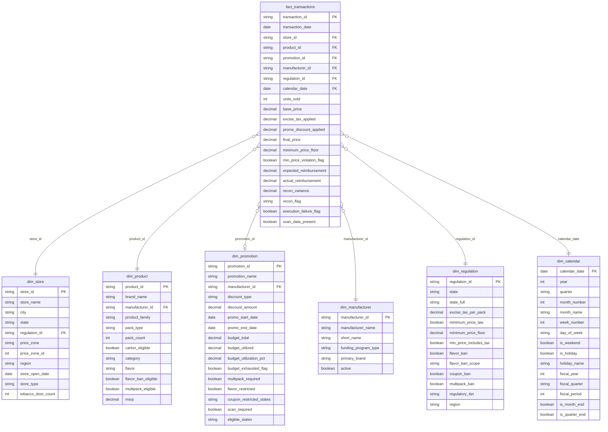

# Project Structure

**Project:** 711-tobacco-promo-analysis  
**Schema Type:** Star schema  
**BI Tool:** Power BI Desktop  
**Data Format:** Excel workbook (7 tabs)

---

## Star Schema Diagram



---

## Relationship Map

### Primary Relationships (fact → dimension)

| Relationship | Join Keys | Cardinality | Notes |
|---|---|---|---|
| `fact_transactions` → `dim_store` | `store_id` | Many-to-one | Every transaction belongs to one store |
| `fact_transactions` → `dim_product` | `product_id` | Many-to-one | Every transaction is for one product |
| `fact_transactions` → `dim_promotion` | `promotion_id` | Many-to-one | NULL when no active promotion |
| `fact_transactions` → `dim_manufacturer` | `manufacturer_id` | Many-to-one | Denormalized from product for direct manufacturer filtering |
| `fact_transactions` → `dim_regulation` | `regulation_id` | Many-to-one | Denormalized from store for direct regulatory filtering |
| `fact_transactions` → `dim_calendar` | `calendar_date` | Many-to-one | Enables all time intelligence in Power BI |

---

## Repository File Structure

```
711-tobacco-promo-analysis/
│
├── README.md                          # Project overview and quick-start
│
├── data/
│   └── 711_cigarette_promo_dataset.xlsx   # Full dataset — 7 tabs (fact + 6 dimensions)
│
├── scripts/
│   ├── build_dataset.py               # Generates all dimension and fact tables
│   ├── style_excel.py                 # Applies formatting, column widths, freeze panes
│   └── run.py                         # Orchestrates the full pipeline
│
├── docs/
│   ├── data_dictionary.md             # All tables, columns, types, and sample values
│   ├── business_logic.md              # Regulatory rules, promo mechanics, simulation parameters
│   ├── project_structure.md           # This file — schema diagram and relationship map
│   └── dashboard_guide.md             # Power BI page descriptions, visuals, and DAX measures
│
└── images/
    ├── dashboard_executive_summary.png
    ├── dashboard_promo_reconciliation.png
    ├── dashboard_manufacturer_funding.png
    ├── dashboard_store_performance.png
    └── dashboard_regulatory_impact.png
```

---

## Script Architecture

### `build_dataset.py`

Generates all seven tables from scratch using `pandas` and `numpy`. Execution order:

1. Build `dim_calendar` — date spine from 2023-01-01 to 2024-12-31
2. Build `dim_regulation` — 15 states with hardcoded regulatory parameters
3. Build `dim_manufacturer` — 7 manufacturers with funding program types
4. Build `dim_product` — 39 SKUs, assigned to manufacturers
5. Build `dim_store` — 619 stores, assigned to states and price zones
6. Build `dim_promotion` — 35 promotional programs with budgets and eligibility rules
7. Build `fact_transactions` — 23,522 transactions drawing from all dimensions

The fact table generation loop:
- Iterates over a stochastic sample of (store, date) pairs
- For each pair, selects an eligible product (respecting flavor ban suppression)
- Determines active promotions (respecting state eligibility, coupon bans, multipack restrictions)
- Applies pricing logic (base price → excise tax → zone adjustment → promo discount)
- Evaluates minimum price compliance
- Assigns reconciliation status and execution failure flags

### `style_excel.py`

Post-processing step that formats the Excel workbook:
- Freeze panes on row 1 for all tabs
- Auto-fit column widths
- Header row styling (bold, background fill)
- Number formatting (currency, percentage, boolean display)
- Tab color coding by table type (fact vs. dimension)

### `run.py`

Single entry point. Calls `build_dataset.py` then `style_excel.py` in sequence and writes the output to `data/711_cigarette_promo_dataset.xlsx`. Running `python scripts/run.py` from the project root is all that is required.

---

## Design Decisions

**Why denormalize `manufacturer_id` and `regulation_id` into the fact table?**  
Power BI performs better and DAX measures are simpler when high-frequency filter dimensions are one hop from the fact table. Manufacturer and regulatory region are the two most common slice-and-dice axes in this dashboard. Requiring a two-hop join through `dim_product` or `dim_store` would complicate every measure involving those filters.

**Why include `dim_calendar` instead of using Power BI's auto date table?**  
The fiscal calendar (July–June basis) doesn't align with Power BI's built-in date intelligence, which assumes a standard January–December fiscal year. A custom `dim_calendar` with explicit fiscal period fields gives full control over fiscal quarter labels, period-over-period comparisons, and year-end boundaries without fighting the default behavior.

**Why is `promotion_id` nullable in the fact table?**  
Because not every transaction is promotional. Approximately 38% of transactions occur outside any active promotion. Nullable foreign keys are standard practice for optional relationships in star schemas and are handled cleanly by Power BI as inactive/unrelated rows in promotion-filtered visuals.

**Why 7 manufacturers rather than a larger set?**  
The real US cigarette market is highly concentrated — two manufacturers (Altria and Reynolds American) account for over 80% of volume. A seven-manufacturer set preserves this concentration while adding enough variety to make funding program comparisons meaningful. More manufacturers would have diluted each manufacturer's data to the point where individual program analysis becomes noise.

---

*For the full regulatory and simulation logic behind the data, see [business_logic.md](business_logic.md).*  
*For Power BI page descriptions and DAX measures, see [dashboard_guide.md](dashboard_guide.md).*
